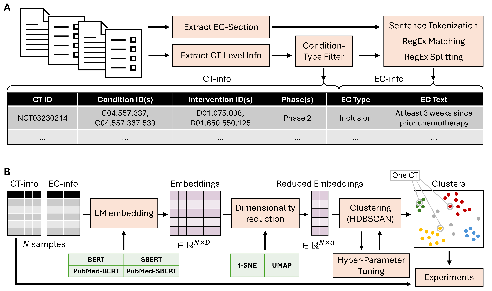

# CTxAI - Eligibility Criteria

This is the repository for the manuscript "Analysis of Eligibility Criterion Clusters Based on Large Language Models for Clinical Trial Design".



## Install Dependencies

You can install the dependencies using Conda (but feel free to use your own ways):

1. Install [Miniconda](https://docs.conda.io/en/latest/miniconda.html) or Anaconda on your system if you haven't already.
2. Create a new Conda environment using the `environment/setup_env.sh` script:

   ```
   ./environment/setup_env.sh
   ```
3. Activate the new environment:

   ```
   conda activate ctxai
   ```

## Running the experiments

Start by downloading the raw dataset by executing:

```
./download_raw_data.sh
```

Then, build the eligibility criterion dataset by executing:

```
python src/parse_data.py
```

Then, run all experiments:

```
python experiments/experiment_1.py
python experiments/experiment_2.py
./experiments/experiment_3.sh
```

Finally, plot the results:

```
python experiments/plot_experiment_1.py
python experiments/plot_experiment_2.py
python experiments/plot_experiment_3.py
```
